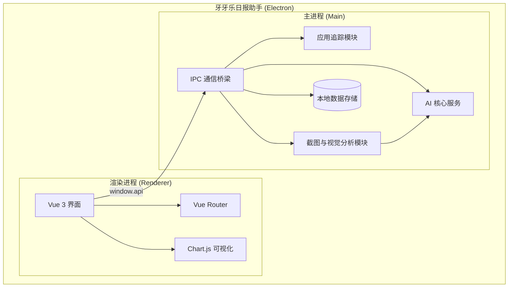
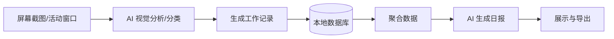

# 牙牙乐日报助手 (Daily Assistant) 开发者教程

> 基于自有 API Key 的开源工作日报生成工具，结合 AI 自动化记录与分析工作内容。

---

## 1. 项目总览

**牙牙乐日报助手** 是一款跨平台的桌面应用程序，旨在帮助用户自动化生成工作日报。它通过在后台静默记录应用使用情况、定时截取屏幕并利用大语言模型（LLM）的视觉能力进行分析，最终聚合生成结构化的高质量工作报告。

### 特性

- ✅ **自动化记录**: 定时截图与活动窗口追踪
- ✅ **AI 智能分析**: 结合视觉大模型自动识别工作内容并分类
- ✅ **隐私优先**: 数据本地存储，敏感信息自动脱敏
- ✅ **多维度可视化**: 提供时间线、时段热力图、应用使用统计
- ✅ **灵活导出**: 支持 Markdown/TXT 导出及自定义报告模板

---

## 2. 快速开始

### 环境要求

- Node.js (推荐 v18+)
- npm 或 pnpm
- 操作系统：Windows / macOS

### 安装

```bash
# 克隆项目后，进入项目目录
cd daily-assistant-clone

# 安装依赖
npm install
```

### 运行

```bash
# 启动开发环境（同时启动 Vite 和 Electron）
npm run dev
```

### 构建

```bash
# 构建生产环境安装包
npm run electron:build
```

---

## 3. 架构设计

### 概述

本项目采用典型的 Electron 双进程架构。前端渲染层使用 Vue 3 + Vite 构建，主进程负责系统级 API 调用（截图、窗口追踪、本地文件读写）以及与 AI 接口的通信。

### 系统架构图



### 数据流



---

## 4. 核心模块详解

### 4.1 主进程入口 (`electron/main.ts`)

**职责**: 管理应用生命周期、托盘图标、窗口创建，以及注册所有的 IPC (Inter-Process Communication) 处理器。

**核心功能**:
- 初始化并挂载各个子模块（数据库、截图、追踪器）。
- 定时任务调度（如定时自动生成日报）。
- 处理来自渲染进程的各类请求。

### 4.2 AI 服务模块 (`electron/ai.ts`)

**职责**: 封装与大语言模型（如 OpenAI 兼容接口）的交互逻辑。

**核心功能**:
- **视觉分析 (`analyzeScreenshot`)**: 将截图转换为 Base64，调用 Vision 模型识别当前工作活动，并严格按照 JSON 格式返回分类与摘要。内置隐私脱敏规则。
- **报告生成 (`generateReport`)**: 接收工作记录、应用使用时长等上下文，通过流式 (Stream) 响应生成 Markdown 格式的日报/周报。
- **文本分类 (`classifySummary`)**: 对手动输入的工作内容进行智能分类。

### 4.3 数据采集模块

- **应用追踪 (`electron/appTracker.ts`)**: 定时轮询操作系统 API，获取当前处于前台的活动窗口，统计各应用的使用时长。
- **屏幕截图 (`electron/screenshot.ts`)**: 定时截取屏幕画面，并调用 `ai.ts` 进行内容识别，识别后即刻销毁图片，保护隐私。

### 4.4 渲染进程视图 (`src/views/`)

- `Today.vue`: 今日工作概览，展示今日记录与快捷操作。
- `Timeline.vue`: 以时间线形式展示一天的工作轨迹。
- `AppUsage.vue` / `Heatmap.vue`: 数据可视化面板，使用 Chart.js 渲染。
- `Reports.vue`: 报告生成与历史记录管理。
- `Settings.vue`: 用户配置界面（API Key、模型选择、定时任务等）。

---

## 5. API 参考 (IPC 接口)

渲染进程通过 `window.api` (在 `preload.ts` 中暴露) 与主进程通信。以下是核心接口：

| 频道 (Channel) | 参数 | 返回值/说明 |
|---------------|------|------------|
| `ai:generate-report` | `GenerateReportInput` | 触发 AI 生成报告，返回 `reportId` |
| `work-records:list` | `{ startDate, endDate }` | 获取指定日期范围的工作记录 |
| `screenshots:status` | 无 | 获取当前截图任务是否正在运行 |
| `settings:get` | 无 | 获取当前应用配置 |
| `settings:update` | `Partial<AppSettings>` | 更新应用配置 |
| `data-management:export`| 无 | 导出所有本地数据为 JSON 备份 |

---

## 6. 配置说明

应用的核心配置存储在本地，可通过设置页面 (`Settings.vue`) 进行修改。

### 核心配置项

| 配置项 | 说明 | 示例/默认值 |
|-------|------|------------|
| `apiKey` | LLM 服务的 API 密钥 | `sk-...` |
| `baseUrl` | API 代理地址 | `https://api.openai.com/v1` |
| `model` | 文本生成模型 | `gpt-4o-mini` |
| `visionModel` | 视觉识别模型 | `gpt-4o` |
| `screenshotInterval` | 截图间隔时间（分钟） | `5` |
| `scheduledReportEnabled`| 是否开启定时生成日报 | `false` |

---

## 7. 部署指南

### 本地构建

项目使用 `electron-builder` 进行打包。构建配置位于 `package.json` 的 `build` 字段中。

```bash
# 执行构建命令
npm run electron:build
```

构建完成后，安装包将生成在 `release/` 目录下。
- Windows: 生成 `.exe` 安装包 (NSIS 目标)
- macOS: 生成 `.dmg` 或 `.app` (需在 Mac 环境下执行)

---

## 8. 测试

### 运行测试

目前项目主要依赖手动测试与本地调试。
在开发模式下，可以通过控制台查看主进程日志，通过 Chrome DevTools 查看渲染进程日志。

```bash
# 启动开发模式进行调试
npm run dev
```

---

## 9. 术语表

| 术语 | 说明 |
|-----|------|
| **IPC** | Inter-Process Communication，进程间通信。Electron 中主进程与渲染进程交互的机制。 |
| **Vision 模型** | 具备视觉理解能力的大语言模型（如 GPT-4o, Claude 3.5 Sonnet），用于分析屏幕截图。 |
| **脱敏** | 在将数据发送给 AI 或记录到数据库前，去除或模糊化敏感信息（如聊天记录、个人隐私）的过程。 |
| **Vite** | 下一代前端构建工具，提供极速的冷启动和热更新。 |

---
*文档生成于: 2026-06-27*
*由 DeepWiki Tutorial Skill 强力驱动*
